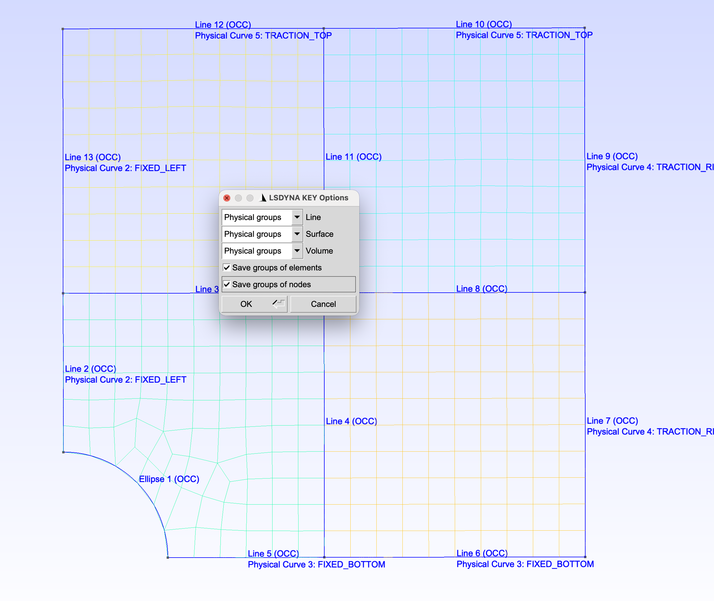

# MAE 5036: 1D Bar FEM

The Gmsh scripts to generate LS-dyna keywords files for multi-dimensional problems. After loading the script, please export it as LS-dyna keywords file with save group elements and nodes CHECKED.

Copyright (c) 2026 Jiarui Wang.
